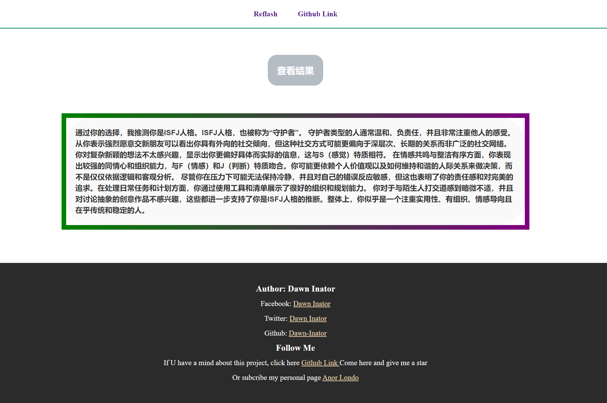

---

  <h2 align="center">MBTI-GPT</h2>
  

    一款使用ChatGPT驱动的MBTI人格测试！
     
     
    <a href="https://mbti.inator.site" target="_blank"><strong>» 👉点击开启我的旅行 »</strong></a>
     
  

 使用框架：html, css, javascript 

